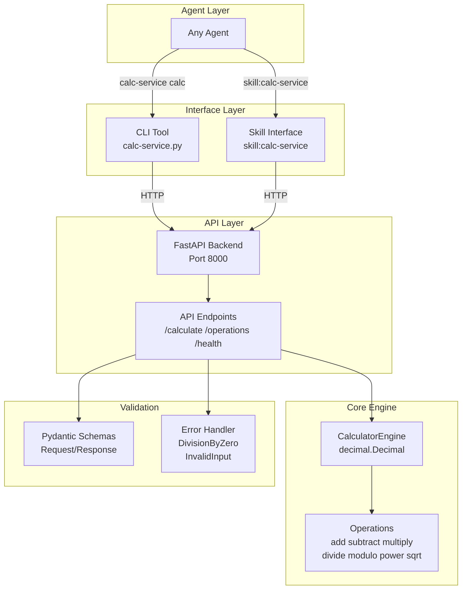
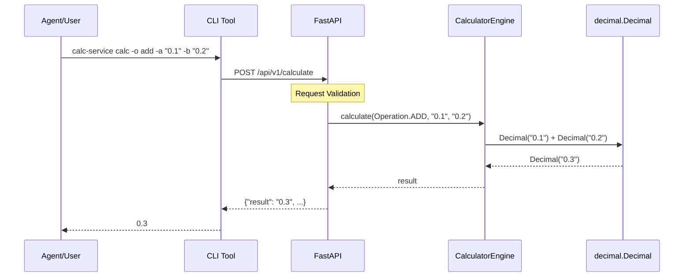
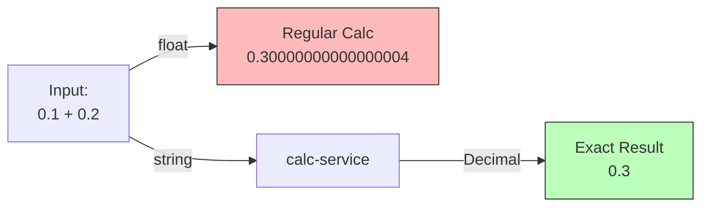

# calc-service Architecture

## System Overview



## Data Flow



## Component Details

| Component | Purpose | Technology |
|-----------|---------|------------|
| **CLI Tool** | Command-line interface for agents | Python + argparse |
| **Skill Interface** | OpenClaw skill wrapper | SKILL.md + Python |
| **FastAPI** | HTTP API server | Python + FastAPI |
| **CalculatorEngine** | Core calculation logic | decimal.Decimal |
| **Pydantic** | Request/response validation | Pydantic v2 |
| **Error Handler** | Custom exceptions | Python classes |

## Precision Guarantee



## API Contract

### Request
```json
{
  "operation": "add",
  "operand_a": "0.1",
  "operand_b": "0.2",
  "precision": 28
}
```

### Response
```json
{
  "result": "0.3",
  "operation": "add",
  "precision": 28,
  "success": true
}
```

### Error Response
```json
{
  "error": {
    "code": "E4001",
    "message": "Divisão por zero não permitida",
    "field": "operand_b"
  },
  "success": false
}
```

## File Structure

```
calc-service/
├── backend/
│   ├── app/
│   │   ├── main.py              # FastAPI entry point
│   │   ├── config.py            # Settings
│   │   ├── api/
│   │   │   └── v1/
│   │   │       └── calculator.py  # Endpoints
│   │   ├── services/
│   │   │   └── calculator.py      # Decimal engine
│   │   └── schemas/
│   │       └── calculation.py     # Pydantic models
│   └── tests/
│       └── test_calculator.py
├── cli/
│   └── calc-service.py          # CLI tool
└── docs/
    └── SKILL.md                 # Agent interface
```

---

**Default for diagrams: Mermaid**  
*Image generation only when explicitly requested*